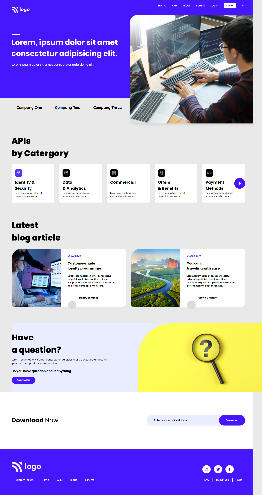

# Project-9 HTML  and CSS 

## Hi, I'm Shyam Tala! 👋

## Screenshots

>I Deployed my Site on Netlify and Vercel. so you can check it out 👇
  [https://production-bug.netlify.app](https://production-bug.netlify.app)
  [https://production-bug.vercel.app/](https://production-bug.vercel.app//)

## What I Learned from this Project?

 
- I learned about flex-box
- I learned about media queery
- I learned about grid system
- I learned about overflow properties of css 

## This Project took around 04:30 Hours to complate.

## Author

- [@shyamtala](https://github.com/shyamtala003)

